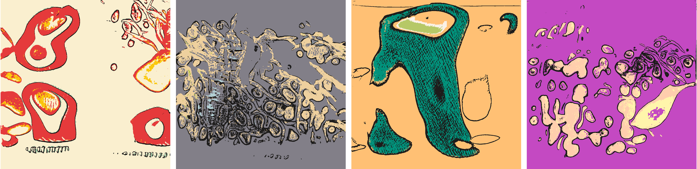

# Confluence

Confluence is a generative art project by [Devi Parikh][devi] on [BrainDrops][braindrops].

## The Concept

This series is part AI, part human analog art, and part human digital art. Pieces are generated using a neural generative model (AI) trained on the artist's physical sketchbook. Generations are re-rendered in a variety of palettes. Taking the confluence of human and machine a step further, the pieces are interpreted by an AI model.

The motivation behind the series was curiosity. Curiosity to see how an AI model will consume art in a sketchbook that was not intended to be coherent and or have an audience. Curiosity to see what form the art will take when reproduced by an AI model -- which features of the generated art will be recognizable as coming from the artist's sketches, which ones will seem foreign, and which ones will be a confluence. Curiosity to see what opportunities the generations from the AI model will present to give the artist their voice back, to make the pieces their own. Again, which features from the AI generations will survive, which ones will be removed, and which ones will be a confluence. Taking a step back, this is an exercise in exploring how AI tools can enhance human creative expression.

## The Visuals

The artist's [physical sketchbook][sketchbook] that the AI model was trained on had sketches, doodles, paper cutting, mandalas, zentangles -- often with a brief hand-written description. 

These are example generations from the AI generative model -- a GAN (Generative Adversarial Network) -- trained on the sketchbook.

These generations are re-rendered using image processing techniques ...

... and then re-colored in one of 39 hand-designed palettes.

The amount of black marks in the piece changes its aesthetic in appealing ways. Some pieces have a *minimal* or a *sparse* set of marks, while others have a *healthy* amount or *many* marks.

In addition to the black marks, each piece may have 1, 2, 3 or 4 colors in it. 

Each piece is re-interpreted by an AI model. It is fascinating to see what an AI model sees in these abstract forms. Think of it like the [Rorschach test][rorschach] or examination of [Pareidolia][pareidolia] in AI models :) AI models may see any one of 52 concepts in these pieces -- ranging from people and animals to everyday objects.

Finally, a piece may be static, or animated!

## The Traits

All in all, the pieces in this series have five traits:
* Media: indicates whether the piece is an image or a short video
  * 2 values: Static, Animated.
* Palette: indicates which palette the colors are from
  * 39 values: Magritte, Birthday, Ethnic, Love, Activity, Cartoon, Neon, Surprise, Cotton-candy, Truth, Safe, Home, Wood, Mighty, Insomnia, Munch, Monet, Gold, Grown-up, Pop, Lichtenstein, Statement, Scheme, Meadow, Cake, Journal, Warhol, Gradient, Salient, Potential, Dali, Iconic, Gauguin, Icing, Deep, Authentic, Bright, Business, Gogh
* Colorful: indicates how many colors a piece has
  * 4 values: Mono, Di, Tri, Tetra
* Marks: indicates the amount of black marks in the pieces
  * 4 values: Minimal, Sparse, Healthy, Many
* AI-Pareidolia: indicates what an AI model sees in the piece
  * 52 values: Skateboard, Fish, Cake, Surfboard, Train, Skateboarder, Face, Woman, Cartoon, Vase, Flower, Scissors, Elephant, Fire-hydrant, Items, Dog, Tree, Kite, Striped, Flag, Collage, Shirt, Paint, Stuffed-animal, Graffiti, Air, People, Bird, Water, Rose, Table, Banana, Cow, Animal, Penguin, Checkered, Bear, Photo, Kitty, Horse, Toy, Sign, Painting, Airplane, Butterfly, Beach, Plant, Person, Girl, Wall, Cat, Man

## The Rarities

The number of pieces out of 1,000 that have each trait will be listed here after the drop.
<!-- [here][rarities]. -->

## The Artist

Devi Parikh is an AI researcher and a generative artist. She also makes [Macrame][macrame], [Origami][origami], and maintains a physical [sketchbook][sketchbook] with kawaii doodles, zentangles, mandalas, paper cutting and sketches. 

While evolving, her generative art so far has tended to have vibrant colors, geometric patterns, symmetries, and crisp textures co-existing with organic shapes. She gets inspiration from a variety of sources -- some mundane, some exotic; some traditional, some unexpected; some specific, some diffused -- colors in rare stones, textures in snake skins, graffiti, wall art, digital illustrations, acrylic pouring, mandalas, ethnic fabrics, looking out the window during a long taxi ride, Indian culture, or feedback from a trusted friend. She maintains an ever growing list of ideas -- ranging from small tweaks to an existing project to entirely new projects or styles. Her process involves starting with an idea, prototyping the core of it to see if it feels right, and then iterating, iterating, iterating. The joy and mystery is in seeing where the iterations lead!

She gets energy out of creative expression. Some of it through her art -- both digital and analog. Some of it through her research in AI. In fact, the two intersect -- part of her work is on developing AI that can enhance human creativity -- give people new tools for creative expression.

She was born in Tulsa, Oklahoma, USA. But you wouldn't guess from her name, how she looks, or how she sounds. She has lived in Riyadh, Saudi Arabia. She grew up in Ahmedabad, India. She has an abysmal sense of space and orientation. She has an excellent sense of time. She hates small talk. She loves deep connections with people. She appeared in Forbes' list of 20 "Incredible Women Advancing A.I. Research". 

She has dabbled in sketching, painting, origami, dancing, music all her life -- she was decent at some of this, not so much at the rest :) She was first introduced to AI in 2003 in junior year of college and has worked in AI since. She was first introduced to generative art by a friend in 2018, when her day-job presented fewer opportunities to be hands-on with code. Generative art scratched the itch to code as well as explore AI for creativity.

Find out more about Devi's art at [http://stateoftheheart.ai/][soth]. You can also find her on [Twitter][tw], [Instagram][insta], [Foundation][fnd] and [fxhash][fxhash]. 

[braindrops]: https://twitter.com/braindrops_art
[sketchbook]: ./sketchbook.html
[macrame]: ./macrame.html
[origami]: ./origami.html
[soth]: http://stateoftheheart.ai/ 
[rorschach]: https://en.wikipedia.org/wiki/Rorschach_test
[pareidolia]: https://en.wikipedia.org/wiki/Pareidolia
[devi]: https://www.cc.gatech.edu/~parikh/
[tw]: https://twitter.com/deviparikh
[insta]: https://www.instagram.com/deviparikh/
[fnd]: https://foundation.app/@deviparikh
[fxhash]:  https://www.fxhash.xyz/u/Devi%20Parikh

